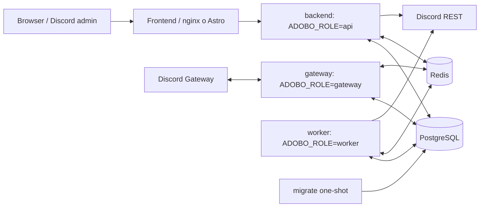

# Plan final 2026 — backend, seguridad y topología split

Estado: propuesta ejecutable, todavía no implementada  
Alcance: `backend/`, `packages/shared/`, infraestructura, pruebas y documentación  
Fuera de alcance: auditoría visual/arquitectónica del frontend, salvo el cableado mínimo de Compose  
Fecha de referencia: 2026-09-04

## 1. Objetivo

Llevar Adobos Bot a una arquitectura operativa única y predecible:

- desarrollo: `docker-compose.yml`, con procesos `gateway`, `api` y `worker` separados y hot reload;
- producción: `docker-compose.prod.yml`, con los mismos tres roles, sin hot reload;
- Redis y PostgreSQL obligatorios en todos los ambientes administrados por Compose;
- eliminación completa de `ADOBO_ROLE=all` del binario, pruebas y documentación;
- corrección por fases de los hallazgos de seguridad, consistencia y escalabilidad detectados en la auditoría;
- una estrategia de pruebas que mantenga los unit tests cerca del código y separe claramente integración y E2E.

Este documento está pensado para que otro agente de código pueda ejecutar el trabajo en commits pequeños, verificables y reversibles. No se debe iniciar una fase si la anterior no cumple sus criterios de salida.

## 2. Resumen ejecutivo de la auditoría

La base actual es buena y no justifica una reescritura ni microservicios:

- monorepo pnpm con contratos compartidos;
- monolito modular con registro de fases HTTP, Gateway y jobs;
- PostgreSQL + Drizzle, Redis + BullMQ y Pino;
- validación Zod consistente en las rutas registradas;
- OAuth2 con PKCE, cookies `HttpOnly`, `Secure` en producción y tokens cifrados con AES-GCM;
- Helmet, CORS por allowlist, límites de payload y uploads;
- cachés acotadas de discord.js, sweepers y soporte de sharding;
- roles desplegables por separado ya implementados;
- 184 pruebas de backend y 166 de shared en verde al auditar;
- CI existente en `.github/workflows/ci.yml` con instalación, build de shared, tests, typecheck y lint.

La prioridad no es aumentar abstracciones, sino cerrar cuatro bordes de riesgo:

| ID | Prioridad | Hallazgo | Resultado requerido |
|---|---:|---|---|
| SEC-01 | P0 | `MANAGE_GUILD` permite usar toda la autoridad del bot | autorización por capacidad y jerarquía del actor |
| SEC-02 | P0 | fondos remotos permiten SSRF y lectura sin límite | cliente de imágenes seguro, acotado y testeado |
| BILL-01 | P0 | webhook Stripe usa check-then-act no atómico | claim idempotente y procesamiento recuperable |
| ECO-01 | P0/P1 | compra puede reembolsarse después de conceder recompensas parciales | saga persistida e idempotente |
| TEN-01 | P1 | uploads sin propiedad de guild ni cuotas | metadatos, autorización y ciclo de vida |
| AUTH-01 | P1 | estado OAuth no se consume atómicamente; sesión almacenada en claro | `DELETE ... RETURNING` y hash de sesión |
| JOB-01 | P1 | entregas Discord admiten duplicados tras crash/retry | IDs estables, ledger y reconciliación |
| OPS-01 | P1 | advisory lock puede perderse sin revocar liderazgo local | lease/heartbeat o monitor de conexión |
| OPS-02 | P1 | readiness ignora Redis, colas y liderazgo | readiness específico por rol |
| MAINT-01 | P2 | gateways, schema y funciones centrales demasiado grandes | división incremental por capacidad/contexto |
| MAINT-02 | P2 | nombres y layout de módulos inconsistentes | convención única sin big-bang rename |

Referencias de criterio:

- Discord separa explícitamente permisos del bot y autorización del usuario: <https://docs.discord.com/developers/platform/oauth2-and-permissions>
- Discord recomienda intents mínimos y sharding según `Get Gateway Bot`: <https://docs.discord.com/developers/events/gateway>
- Stripe puede duplicar, reintentar y entregar eventos fuera de orden: <https://docs.stripe.com/webhooks>
- OWASP trata la descarga de imágenes indicadas por usuarios como caso directo de SSRF: <https://cheatsheetseries.owasp.org/cheatsheets/Server_Side_Request_Forgery_Prevention_Cheat_Sheet.html>
- BullMQ exige jobs simples e idempotentes para que los reintentos sean seguros: <https://docs.bullmq.io/patterns/idempotent-jobs>
- IDs personalizados de BullMQ ayudan a deduplicar jobs pendientes: <https://docs.bullmq.io/guide/jobs/job-ids>

## 3. Arquitectura objetivo



Invariantes:

1. Solo `gateway` mantiene un `Client`/WebSocket de Discord.
2. `api` y `worker` usan `RestGateway` y por ello requieren `DISCORD_TOKEN`.
3. Los tres roles requieren `REDIS_URL`; no hay fallback operativo en memoria.
4. `ADOBO_ROLE` es obligatorio y solo acepta `api | gateway | worker`.
5. Solo `api` expone la API completa; `gateway` y `worker` exponen health.
6. El mismo artefacto de backend se utiliza para los tres roles de producción.
7. El servicio `migrate` termina correctamente antes de arrancar procesos de aplicación.
8. Escalar `api` no inicia gateways ni schedulers adicionales.
9. Escalar gateways requiere rangos `SHARDS` disjuntos con el mismo `SHARD_TOTAL`.

## 4. Decisión sobre organización de tests

No se recomienda mover todos los tests actuales fuera de `src`. Para unit tests, la co-localización es una práctica adecuada: permite descubrir el comportamiento junto a la implementación y hace más evidentes los cambios que requieren actualizar pruebas.

Estructura objetivo:

```text
backend/
├── src/
│   └── **/*.test.ts              # unitarios y contract tests pequeños
├── test/
│   ├── integration/              # PostgreSQL, Redis, filesystem, concurrencia
│   ├── e2e/                      # proceso HTTP/Compose y flujos completos
│   ├── fixtures/
│   └── support/                  # factories, DB reset, fake Discord/Stripe
├── vitest.config.ts              # unitarios rápidos
├── vitest.integration.config.ts
└── vitest.e2e.config.ts
```

Reglas:

- `*.test.ts` junto al código: funciones puras, schemas, permisos, mappers y handlers con mocks pequeños.
- `test/integration`: toda prueba que necesite PostgreSQL, Redis, reloj compartido, locks o filesystem real.
- `test/e2e`: Compose, HTTP real, readiness y arranque por rol.
- No mockear Drizzle para validar transacciones, constraints o carreras; usar una BD real aislada.
- No contactar Discord o Stripe reales en CI. Usar fakes HTTP y payloads firmados de prueba.
- Cada corrección de P0/P1 debe incluir primero una prueba que reproduzca el defecto.
- Unitarios deben mantenerse rápidos y ejecutarse en cada push; integración puede ser un job CI separado.

Scripts objetivo en `backend/package.json`:

```json
{
  "test": "pnpm test:unit",
  "test:unit": "vitest run",
  "test:integration": "vitest run --config vitest.integration.config.ts",
  "test:e2e": "vitest run --config vitest.e2e.config.ts",
  "test:coverage": "vitest run --coverage"
}
```

No imponer un porcentaje global alto de cobertura inicialmente. Empezar con umbrales sobre código crítico nuevo y exigir cobertura de ramas para autorización, facturación, economía y parsing de entorno.

## 5. Estrategia de ejecución

Cada fase debe seguir este ciclo:

1. Capturar baseline y estado del worktree.
2. Añadir o ajustar pruebas que expresen el comportamiento deseado.
3. Realizar el cambio mínimo.
4. Ejecutar pruebas focalizadas.
5. Ejecutar gates completos de backend/shared.
6. Revisar `git diff` y confirmar que no se incluyeron cambios ajenos.
7. Hacer un commit único por fase o subfase independiente.

Gates comunes:

```bash
pnpm --filter @adobos/shared build
pnpm --filter @adobos/shared test
pnpm --filter @adobos/backend typecheck
pnpm --filter @adobos/backend test
pnpm lint
git diff --check
```

Si se modifica `backend/src/db/schema.ts`, seguir exclusivamente el flujo Drizzle documentado en `AGENTS.md`; commitear SQL, snapshot y journal juntos. Nunca editar migraciones generadas o `_journal.json` manualmente.

## 6. Fase 0 — Baseline y protección del trabajo existente

Objetivo: evitar que la consolidación pise cambios ya presentes.

Trabajo:

- registrar `git status --short` y `git diff`;
- preservar los cambios existentes en `.dockerignore`, `docker-compose.split.yml` y `docker/Dockerfile.frontend`;
- verificar que el cambio de formato de `Dockerfile.frontend` no se mezcle conceptualmente con la consolidación;
- ejecutar los gates comunes;
- guardar la salida de `docker compose config` para los tres Compose actuales como referencia temporal;
- listar imágenes, volúmenes y contenedores existentes antes de cualquier prueba de boot.

Criterio de salida:

- baseline verde o fallos preexistentes documentados;
- ninguna modificación ajena revertida;
- se conoce qué volúmenes contienen datos de desarrollo y no se ejecutará `down -v` sobre ellos.

Rollback: no aplica; esta fase es de lectura.

## 7. Fase 1 — Eliminar `ADOBO_ROLE=all`

### 7.1 Runtime

Modificar `backend/src/core/runtime/index.ts`:

- `ADOBO_ROLES = ["api", "gateway", "worker"] as const`;
- inicializar `current` en `"api"` solo como valor interno defensivo;
- `roleRunsHttp(role) => role === "api"`;
- `roleRunsGateway(role) => role === "gateway"`;
- `roleRunsWorker(role) => role === "worker"`;
- actualizar comentarios que mencionen `all`.

No cambiar la orquestación de `backend/src/index.ts`, salvo comentarios obsoletos. Los helpers deben hacer que la lógica se simplifique por sí sola.

### 7.2 Entorno

Modificar `backend/src/core/env.ts`:

- hacer `ADOBO_ROLE` obligatorio, sin default;
- hacer `REDIS_URL` obligatorio y validar `redis://` o `rediss://`;
- hacer `DISCORD_TOKEN` obligatorio para los tres roles;
- mantener la comprobación de que `DISCORD_CLIENT_SECRET !== DISCORD_TOKEN`;
- actualizar error de rol a `Use api | gateway | worker.`;
- reflejar los campos como obligatorios en `AppEnv`.

Mejora recomendada para testabilidad: extraer una función pura `parseEnv(input: NodeJS.ProcessEnv): AppEnv` y dejar `loadEnv()` como cache fino alrededor de ella. Evita manipular cache global y `process.env` entre pruebas.

### 7.3 Pool PostgreSQL

Modificar `backend/src/db/client.ts`:

- conservar `api=8`, `gateway=6`, `worker=6`;
- eliminar el valor semántico de `all`;
- usar `6` como fallback defensivo, con comentario explícito;
- idealmente añadir un `assertNever` si se cambia `poolMax` para recibir el rol como parámetro.

### 7.4 Pruebas unitarias

Reescribir `backend/src/core/runtime/runtime.test.ts` con una matriz:

| rol | HTTP | Gateway | Worker |
|---|---:|---:|---:|
| api | sí | no | no |
| gateway | no | sí | no |
| worker | no | no | sí |

Casos adicionales:

- `isAdobosRole` acepta exactamente los tres valores;
- rechaza `all`, vacío, mayúsculas, espacios y valores desconocidos;
- cada rol activa una sola fase.

Crear `backend/src/core/env.test.ts`:

- falta `ADOBO_ROLE` → error;
- `ADOBO_ROLE=all` → error con lista nueva;
- falta `REDIS_URL` en cada rol → error;
- URL Redis inválida → error;
- falta `DISCORD_TOKEN` en cada rol → error;
- configuración mínima válida para `api`, `gateway` y `worker`;
- client secret igual al token → error;
- CORS ausente en producción → error.

Criterios de salida:

- `rg -n 'ADOBO_ROLE.*all|role === "all"|\["all"' backend/src` no encuentra semántica de runtime;
- tests de runtime y env verdes;
- typecheck y suite completa verdes.

Rollback: revertir solo esta fase; aún no renombrar Compose si los tres roles no arrancan unitariamente.

## 8. Fase 2 — Consolidar Compose a dos topologías

### 8.1 Producción

Usar `git mv docker-compose.split.yml docker-compose.prod.yml` para conservar historial. El contenido actual de `docker-compose.split.yml`, incluyendo los ajustes ya presentes, es la base canónica.

Ajustes:

- encabezado: `Producción — topología split`;
- comandos de ejemplo apuntan a `docker-compose.prod.yml`;
- eliminar comparación con el antiguo nodo único;
- mantener `postgres`, `redis`, `migrate`, `gateway`, `worker`, `backend` y `frontend`;
- mantener una única build canónica de `adobos-backend:latest` en `gateway`;
- `gateway`, `worker` y `backend` dependen de `migrate` completado y Redis healthy;
- mantener `backend` sin puerto público en producción; nginx sigue siendo el único ingress;
- no introducir `ADOBO_ROLE` en el anchor común: cada proceso debe declararlo explícitamente.

Antes del rename, revisar el diff existente de `docker-compose.split.yml` y preservarlo íntegramente.

### 8.2 Desarrollo split con hot reload

Reemplazar el contenido monolítico de `docker-compose.yml` con:

- `postgres` y `redis` publicados al host para herramientas locales;
- `install` usando `docker/Dockerfile.dev`, `adobos-dev:local` y los volúmenes actuales;
- `migrate` one-shot, dependiente de `install` y PostgreSQL healthy;
- `gateway`, `worker` y `backend`, todos con `pnpm --filter @adobos/backend dev`;
- `ADOBO_ROLE` explícito por servicio;
- `backend` publica `3000:3000`;
- `frontend` conserva Astro dev en `4321`, proxy a `http://backend:3000`;
- `PUBLIC_APP_URL` y `CORS_ORIGIN` en `http://localhost:4321`;
- los tres procesos backend montan el repo, `/data`, módulos y pnpm store;
- los tres dependen de `migrate` completado y Redis healthy;
- healthcheck reutilizable para los tres roles;
- `stop_grace_period: 20s`.

Precauciones:

- todos pueden usar puerto interno `3000` porque están en contenedores distintos;
- solo `backend` publica el puerto al host;
- no publicar health de `gateway`/`worker` salvo durante diagnóstico;
- no borrar volúmenes automáticamente;
- documentar que una migración creada durante hot reload puede provocar reinicios concurrentes. La solución definitiva está en Fase 6.

### 8.3 Validación estática de Compose

```bash
docker compose config --quiet
docker compose -f docker-compose.prod.yml config --quiet
docker compose config --services
docker compose -f docker-compose.prod.yml config --services
```

Ambas listas deben contener exactamente:

```text
postgres redis install? migrate gateway worker backend frontend
```

`install` solo existe en desarrollo.

### 8.4 Smoke tests de arranque

Producción:

```bash
docker compose -f docker-compose.prod.yml build
docker compose -f docker-compose.prod.yml up -d
docker compose -f docker-compose.prod.yml ps
docker compose -f docker-compose.prod.yml logs --no-color gateway worker backend migrate
curl --fail http://localhost:${FRONTEND_PORT:-3000}/api/health
```

Desarrollo:

```bash
docker compose build
docker compose up -d
docker compose ps
docker compose logs --no-color gateway worker backend migrate frontend
curl --fail http://localhost:3000/api/health
curl --fail http://localhost:4321/
```

En logs debe observarse:

- `gateway`: fase Gateway activa, sin HTTP completo ni jobs;
- `worker`: jobs activos, sin Client Discord;
- `backend`: HTTP activo, sin Client Discord ni jobs;
- ningún proceso imprime comportamiento de `all`;
- `migrate` termina con código 0.

Pruebas negativas:

- iniciar backend sin `ADOBO_ROLE` → falla antes de escuchar;
- `ADOBO_ROLE=all` → falla con mensaje nuevo;
- cualquier rol sin Redis → falla;
- cualquier rol sin token Discord → falla.

Criterio de salida:

- solo existen `docker-compose.yml` y `docker-compose.prod.yml`;
- no existe `docker-compose.split.yml`;
- ambas topologías pasan `config` y smoke tests;
- hot reload reinicia únicamente el servicio cuyo watcher detecta el cambio, aunque los tres monten el repo;
- health y frontend responden.

Rollback: restaurar nombres/contenidos desde el commit anterior sin borrar volúmenes.

## 9. Fase 3 — Documentación y automatización de la topología

Actualizar `.env.example`:

- `ADOBO_ROLE=` visible y obligatorio, con valores permitidos;
- `REDIS_URL` obligatorio;
- `DISCORD_TOKEN` obligatorio;
- pool: `api=8`, `gateway/worker=6`;
- eliminar toda mención a fallback en memoria o rol `all`.

Actualizar `README.md`:

- dos Compose solamente;
- árbol de archivos actualizado;
- comandos de dev y prod;
- tabla corta de roles;
- advertencia de sharding y rangos disjuntos.

Actualizar `ROADMAP.md`:

- eliminar fila `all` y referencias históricas activas;
- declarar split como topología única;
- actualizar `LocalClientGateway`: solo `gateway`;
- actualizar nombres de Compose.

Actualizar `.github/workflows/ci.yml`:

- mantener tests/shared/typecheck/lint;
- añadir `docker compose config --quiet` para ambos archivos;
- añadir una búsqueda que falle si reaparece semántica `ADOBO_ROLE=all`;
- opcionalmente construir las imágenes sin arrancarlas en cada PR;
- reservar los smoke tests completos para main, workflow manual o nightly para no requerir secretos Discord en PRs.

Crear un test de documentación/configuración pequeño, o script `scripts/check-runtime-topology.mjs`, que compruebe:

- dos Compose esperados y ausencia de split antiguo;
- tres roles exactos en runtime;
- roles explícitos en Compose;
- ausencia de rol `all` en docs/config relevantes.

Criterio de salida: una búsqueda global de referencias al Compose antiguo o al rol eliminado solo puede devolver changelog/historia deliberada.

## 10. Fase 4 — Seguridad P0

### 10.1 SEC-01: autorización por capacidad

Diseñar un puerto central, por ejemplo `core/authz/guildPolicy.ts`:

```ts
type GuildCapability =
  | "settings.read"
  | "settings.write"
  | "moderation.warn"
  | "moderation.kick"
  | "moderation.ban"
  | "moderation.timeout"
  | "roles.write"
  | "channels.write"
  | "webhooks.write"
  | "billing.write";
```

Trabajo:

- conservar `requireGuildAccess` para pertenencia y acceso básico;
- añadir `requireGuildCapability(capability)` o una comprobación en el caso de uso;
- obtener permisos efectivos del actor mediante Discord y cachearlos brevemente;
- validar jerarquía actor–objetivo además de jerarquía bot–objetivo;
- aplicar mínimo privilegio por ruta;
- registrar capacidad, actor y guild en action log, sin tokens.

Tests unitarios:

- owner/admin bypass explícito;
- `ManageGuild` no concede ban/kick/roles automáticamente;
- permiso exacto permite la acción;
- actor no puede operar sobre miembro con rol igual/superior;
- el bot sin jerarquía suficiente sigue siendo rechazado;
- caché nunca cruza guilds o usuarios.

Tests integración/HTTP:

- una sesión autorizada para configurar, pero sin `BanMembers`, recibe 403 en ban;
- el mismo usuario conserva acceso de lectura permitido;
- owner puede ejecutar la acción si el bot puede.

### 10.2 SEC-02: fetch seguro de imágenes

Crear una única abstracción, por ejemplo `core/http/safeImageFetch.ts`:

- HTTPS por defecto; HTTP solo si hay razón documentada;
- bloquear credenciales en URL;
- resolver A y AAAA;
- bloquear loopback, link-local, privadas, multicast y rangos especiales;
- no seguir redirect automáticamente; validar cada salto y limitar su cantidad;
- timeout de conexión y total;
- abortar streaming al superar el límite;
- comprobar `Content-Type` y magic bytes;
- no reflejar URL completa ni cuerpos en logs;
- opcional: allowlist de CDN y proxy/cache de imágenes.

Tests unitarios:

- IPv4/IPv6 privadas y formatos alternativos rechazados;
- localhost y hostname que resuelve a privado rechazados;
- redirects público→privado rechazados;
- archivo mayor al límite abortado;
- HTML con MIME de imagen rechazado;
- imagen válida pequeña aceptada;
- timeout y cancelación liberan recursos.

### 10.3 Logging seguro

- reemplazar `req.originalUrl` por ruta/path normalizado;
- sanitizar queries permitidas si alguna debe registrarse;
- limitar longitud y formato de request ID recibido;
- añadir redacción para firmas, cookies, authorization y secretos Stripe/OAuth.

Test: callback OAuth con `code`/`state` no deja esos valores en el sink de logs.

Criterio de salida de Fase 4: ningún usuario con permisos inferiores puede amplificar autoridad mediante el bot y ninguna URL administrada por un guild puede alcanzar red interna o descargar cuerpos ilimitados.

## 11. Fase 5 — Idempotencia y consistencia

### 11.1 BILL-01: inbox de Stripe

Evolucionar la tabla de eventos a un inbox persistente:

- PK/unique por `event_id`;
- `type`, `object_id`, `status`, `attempts`, `received_at`, `processed_at`, `last_error`;
- claim atómico con `INSERT ... ON CONFLICT DO NOTHING`;
- responder 2xx después de validar firma y persistir/enqueue, no después de lógica larga;
- worker procesa por ID y recupera el objeto vigente si es necesario;
- no depender del orden de eventos;
- dead-letter/reconciliación para fallos permanentes.

Tests:

- misma entrega dos veces produce un solo efecto;
- dos claims concurrentes producen un ganador;
- crash entre claim y complete se recupera;
- eventos fuera de orden convergen al estado actual;
- firma inválida nunca persiste;
- asignación concurrente de asientos no excede límite.

### 11.2 ECO-01: saga de compras

- insertar compra `pending` antes de efectos Discord;
- debitar saldo/stock y crear la saga en una transacción;
- modelar pasos de recompensa con estado e idempotency key;
- ejecutar pasos secuencialmente o como jobs independientes explícitos;
- nunca reembolsar automáticamente una recompensa ya concedida sin compensación real;
- reconciliador para compras `pending` antiguas;
- historial suficiente para soporte manual.

Tests:

- segundo paso falla después de conceder el primero;
- retry no duplica rol/canal/boost;
- crash después del side effect y antes de confirmar paso;
- compra concurrente con stock 1 tiene un ganador;
- saldo nunca queda negativo;
- compensación produce un estado auditable.

### 11.3 JOB-01: entregas programadas

- asignar `jobId` estable derivado de entidad + versión/ocurrencia;
- ledger `pending/sending/sent/failed`;
- distinguir explícitamente entrega at-least-once de exactamente-once, que Discord no garantiza;
- reconciliar leases expirados;
- no eliminar recordatorios hasta persistir el resultado.

Criterio de salida: reintentar cualquier evento/job no cambia el estado final más de una vez ni regala recompensas.

## 12. Fase 6 — Operación multi-proceso y multi-tenant

### 12.1 Migraciones

Separar conexión de aplicación y migración:

- `connectDatabase()` no aplica migraciones;
- `migrateDatabase()` solo se usa en CLI/servicio `migrate`;
- los tres procesos de aplicación esperan al one-shot y luego solo conectan;
- introducir, si se necesita compatibilidad temporal, `RUN_MIGRATIONS=false` por defecto en producción.

Esto evita que hot reload o escalado lancen migradores concurrentes después del arranque inicial.

### 12.2 Worker leadership

- sustituir el booleano de proceso por lease renovable con expiración y fencing token, o vigilar activamente la conexión del advisory lock;
- revocar liderazgo inmediatamente al perder la conexión;
- readiness del worker falla si debe liderar y no posee lease válido;
- probar pérdida de conexión y adquisición por segunda réplica.

### 12.3 Readiness por rol

- liveness: proceso/event loop vivo, sin dependencias externas;
- readiness `api`: PostgreSQL + Redis + capacidad REST esencial;
- readiness `gateway`: PostgreSQL + Redis + Client ready;
- readiness `worker`: PostgreSQL + Redis + consumidores activos + estado de liderazgo esperado;
- no mezclar liveness con readiness en healthchecks de reinicio.

### 12.4 Uploads

- tabla de assets con `guild_id`, owner, tamaño, hash, MIME, estado y timestamps;
- paths/keys por tenant;
- autorización de lectura y borrado;
- cuotas por guild y globales;
- limpieza de huérfanos;
- migrar a storage compatible con S3/R2 antes de escalar a múltiples hosts;
- URLs firmadas o endpoint autenticado.

### 12.5 Sesiones y rate limiting

- almacenar hash SHA-256 de session ID;
- consumir OAuth state con `DELETE ... RETURNING`;
- convertir upserts select-then-insert en `ON CONFLICT`;
- hashear SID en claves Redis;
- usar usuario autenticado + guild canónico en rate limits;
- añadir protección CSRF/Origin para mutaciones y eliminar logout por GET.

## 13. Fase 7 — Mantenibilidad y estructura

Realizar esta fase de forma incremental y sin mezclarla con P0/P1.

Convenciones:

- archivos TypeScript en `kebab-case`;
- clases/interfaces/tipos en PascalCase;
- funciones/variables en camelCase;
- tests conservan `<archivo>.test.ts`;
- no crear nuevos buckets genéricos `utils/`;
- comentarios en español y strings de usuario en inglés, según `AGENTS.md`.

Layout recomendado por módulo:

```text
modules/<feature>/
├── module.ts
├── domain/
├── application/
├── infrastructure/
│   ├── db/
│   ├── discord/
│   └── queue/
├── http/
└── *.test.ts
```

Acciones concretas:

- actualizar `backend/src/modules/README.md`, actualmente describe `index.ts` y rutas antiguas;
- dividir `BotGateway` por capacidades para que módulos dependan de puertos pequeños;
- dividir `BaseGateway`, `RestGateway` y `LocalClientGateway` por responsabilidad;
- mover `backend/src/db/reaction-roles.ts` al módulo propietario o formalizar repositorios;
- reubicar `backend/src/utils/cardEmojis.ts` en el dominio/presentación que lo posee;
- dividir `backend/src/db/schema.ts` por bounded context, reexportando un schema unificado;
- usar `jsonb` tipado para documentos reales y tablas hijas para colecciones consultables;
- refactorizar `executeModAction`, `runVoiceRoomAction`, `handleBlackjackButton`, `recordActionLog` y otros hotspots en handlers/estrategias;
- dividir archivos grandes de shared en `contracts`, `schemas`, `defaults` y lógica, con subpath exports;
- crear calendario para retirar aliases/campos `@deprecated`.

Reglas de migración de nombres:

- un módulo por PR o commit; no renombrar 70 archivos a la vez;
- dejar imports corregidos y typecheck verde en cada paso;
- no mezclar rename con cambio de comportamiento;
- en sistemas case-insensitive, usar rename intermedio para cambios solo de mayúsculas.

## 14. Fase 8 — Supply chain, observabilidad y capacidad

- actualizar Express/lockfile hasta resolver las alertas moderadas transitivas de `qs`;
- ejecutar `pnpm audit --prod` en CI con política explícita de severidad;
- fijar imágenes Docker por versión/digest y automatizar actualizaciones;
- generar SBOM y escanear imágenes;
- evaluar Redis AOF si la pérdida de jobs entre snapshots no es aceptable;
- usar `rediss://`, autenticación y ACL cuando Redis deje la red local de Compose;
- métricas por rol: latencia HTTP, Discord REST 429, reconnects/shards, profundidad de colas, retries, jobs stalled, pool DB y event-loop lag;
- alertas por webhook inbox atrasado, compras pending antiguas y worker sin liderazgo;
- prueba de carga del API con N réplicas y presupuesto total de conexiones PostgreSQL;
- runbook de recuperación de Postgres, Redis, gateway y webhook backlog.

## 15. Orden de commits sugerido

1. `test(runtime): cover split roles and env validation`
2. `refactor(runtime): remove ADOBO_ROLE all`
3. `infra(compose): consolidate dev and prod split topologies`
4. `docs(runtime): document mandatory split deployment`
5. `ci(compose): validate topology and removed role`
6. `security(authz): enforce per-action guild capabilities`
7. `security(images): harden remote image fetching`
8. `security(logging): scrub URLs and request identifiers`
9. `fix(billing): make Stripe event processing idempotent`
10. `fix(economy): persist and reconcile purchase sagas`
11. `fix(jobs): add stable ids and delivery ledger`
12. `fix(runtime): harden worker leadership and readiness`
13. `security(uploads): enforce tenant ownership and quotas`
14. `security(auth): harden sessions OAuth state and rate keys`
15. `refactor(architecture): split gateways schema and hotspots`

Cada commit debe ser desplegable o estar protegido por una migración/feature flag. Los cambios de schema y código consumidor deben seguir una secuencia expand-migrate-contract cuando haya datos existentes.

## 16. Definition of done global

La iniciativa se considera terminada cuando:

- solo existen dos Compose y ambos representan la misma separación de roles;
- `all` ya no es un rol válido, valor por defecto ni ruta documentada;
- Redis, token Discord y rol son obligatorios al boot;
- dev y prod pasan smoke tests de `gateway`, `worker`, `api` y frontend;
- CI valida ambos Compose y los tres roles;
- autorización del panel respeta permisos y jerarquía del actor;
- las descargas remotas no pueden alcanzar redes privadas ni exceder límites;
- webhooks, compras y jobs sobreviven duplicados, carreras y reintentos;
- uploads están ligados a tenant y sujetos a cuotas;
- readiness representa las dependencias reales de cada rol;
- unit, integration y E2E tienen comandos y ubicaciones inequívocas;
- typecheck, lint, backend tests y shared tests están verdes;
- migraciones Drizzle están completas y una segunda generación informa que no hay cambios;
- documentación y runbooks coinciden con el comportamiento desplegado;
- no se han incluido ni revertido cambios del usuario fuera del alcance de cada fase.

## 17. Límites de esta auditoría

La auditoría fue estática y estructural, apoyada por el grafo del código, pruebas existentes y configuración. No incluyó pentest activo, carga real contra Discord, ejecución con secretos de producción, restauración de backups ni simulación completa de fallos de red. Esas actividades deben formar parte de las fases de integración, caos controlado y readiness antes de exposición pública amplia.
